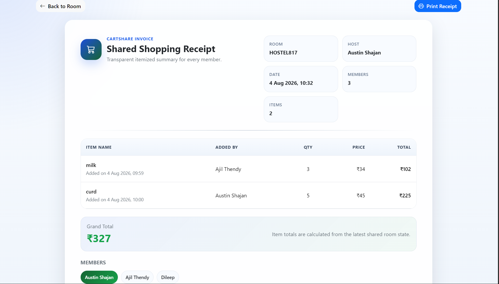
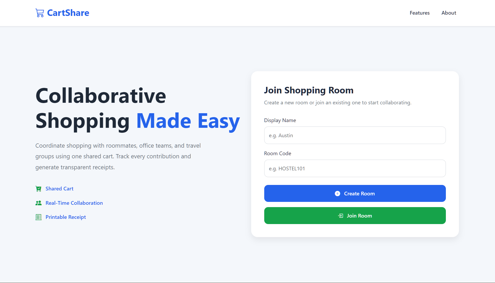

# CartShare


CartShare is a polished collaborative shopping web application that lets multiple users create or join a shared room, manage a shopping cart together, track live activity, and generate a printable receipt. It is a static front-end app built for smooth room-based collaboration using browser LocalStorage and cross-tab synchronization.

## Project Overview

CartShare is designed for roommates, teams, and small groups that need a shared shopping space without a backend. Each room acts as a collaborative workspace where users can add items, view contributors, keep track of totals, and export a clean invoice-style receipt.

The application keeps the original feature set intact while focusing on a professional dashboard experience, better readability, responsive layouts, and stronger accessibility.

## Live Demo

Open the deployed app here: https://cartshare-five.vercel.app/

## Features

- Room creation and room joining flow
- Shared shopping cart with LocalStorage persistence
- Live updates across open browser tabs
- Members list with host identification
- Dashboard statistics for members, items, total, and connection status
- Shopping cart search and sorting
- Item added-by and added-at tracking
- Activity timeline with relative timestamps
- Bootstrap toast notifications
- Bootstrap confirmation modal for empty-cart actions
- Receipt generation with print-optimized invoice layout
- Responsive UI for mobile, tablet, laptop, and desktop

## Screenshots

Add your project screenshots here after capturing the current UI.

### Room Dashboard


### Receipt View



### Landing Page



## Tech Stack

- HTML5
- CSS3
- JavaScript (ES6+)
- Bootstrap 5.3
- Bootstrap Icons
- Browser LocalStorage

## Folder Structure

```text
CartShare-main/
├── index.html
├── README.md
├── assets/
│   └── images/
│       └── icons/
│           └── logo/
│               └── favicon.svg
├── css/
│   ├── style.css
│   ├── room.css
│   └── receipt.css
├── js/
│   ├── app.js
│   ├── room.js
│   ├── receipt.js
│   └── storage.js
└── pages/
	├── room.html
	└── receipt.html
```

## Installation

CartShare is a static site, so no build step is required.

1. Clone the repository.
2. Open the project folder in VS Code or your preferred editor.
3. Launch `index.html` in a browser or use Live Server.

If you want to run it locally with a lightweight server, you can use the VS Code Live Server extension or any static file server.

## Usage

1. Open the landing page.
2. Enter a display name.
3. Create a new room or join an existing room with a room code.
4. Add shopping items, quantities, and prices.
5. Use search and sort to organize the cart.
6. Review activity updates and member status.
7. Open the receipt page to print or save the invoice.

## Project Architecture

CartShare follows a simple client-side architecture:

- `index.html` handles room creation and joining.
- `js/app.js` manages the landing page interactions.
- `pages/room.html` is the collaboration dashboard.
- `js/room.js` owns room state, rendering, search, sort, activity updates, and LocalStorage sync.
- `pages/receipt.html` renders the invoice view.
- `js/receipt.js` builds the printable receipt from the saved room data.
- `css/style.css`, `css/room.css`, and `css/receipt.css` control the visual presentation.
- `assets/images/icons/logo/favicon.svg` provides the app favicon and brand mark.

Data is stored in the browser using LocalStorage, which keeps the application lightweight and easy to run without a backend.

## Acknowledgements

Developed as part of the Website Design & Development Internship Project.

Special thanks to the internship mentors and reviewers.

## License

This project is licensed under the MIT License.

If you plan to publish or distribute the project, add a `LICENSE` file at the repository root with the full MIT text.
